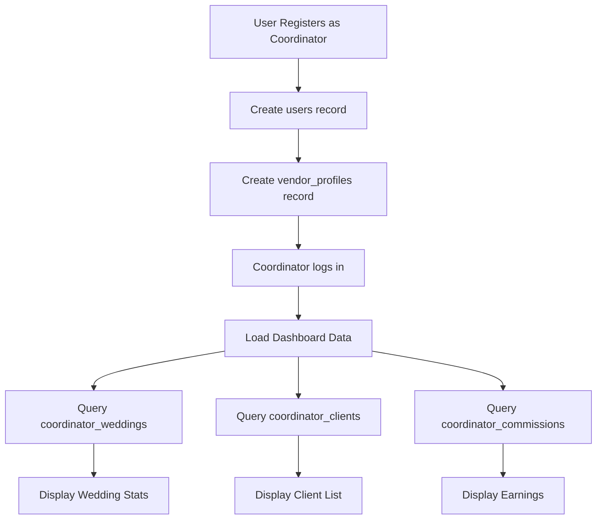
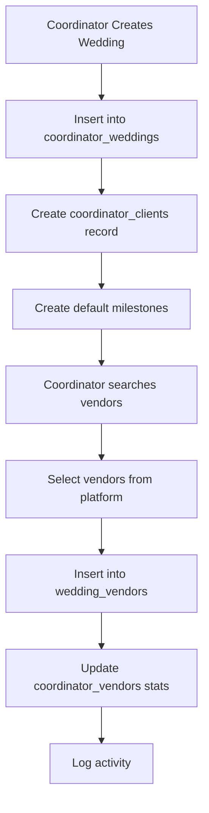
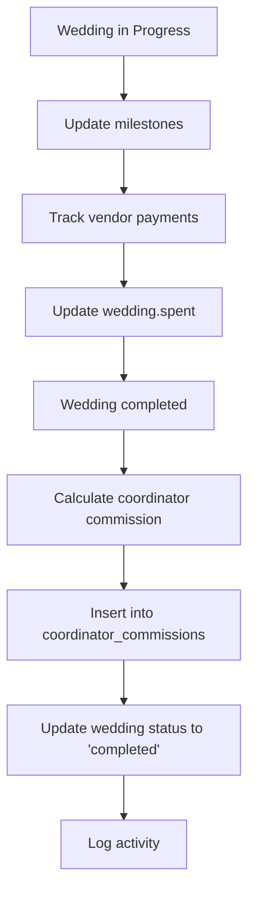

# 🗺️ COORDINATOR DATABASE MAPPING & IMPLEMENTATION PLAN

**Last Updated**: November 1, 2025  
**Status**: ✅ COMPLETE - Ready for Implementation  
**Project**: Wedding Bazaar - Coordinator Feature Database Integration

---

## 📋 TABLE OF CONTENTS

1. [Executive Summary](#executive-summary)
2. [Current Database Schema](#current-database-schema)
3. [Coordinator Tables Available](#coordinator-tables-available)
4. [Data Flow Mapping](#data-flow-mapping)
5. [API Endpoints Checklist](#api-endpoints-checklist)
6. [Frontend Components Mapping](#frontend-components-mapping)
7. [Implementation Plan](#implementation-plan)
8. [Database Migration Scripts](#database-migration-scripts)
9. [Testing & Validation](#testing--validation)

---

## 🎯 EXECUTIVE SUMMARY

### Current Status
- ✅ **Coordinator Registration**: WORKING - Creates user in `users` table and profile in `vendor_profiles`
- ✅ **Coordinator Tables**: EXIST - 7 specialized tables ready for event management features
- ⚠️ **API Endpoints**: NOT YET IMPLEMENTED - Need to create coordinator-specific routes
- ⚠️ **Frontend**: PARTIALLY READY - Dashboard structure exists, needs data integration

### What We Have
1. ✅ User authentication for coordinators
2. ✅ Profile storage in `vendor_profiles` table
3. ✅ 7 specialized coordinator tables (weddings, vendors, milestones, etc.)
4. ✅ Database indexes and triggers
5. ✅ Views for reporting and analytics

### What We Need
1. 🔨 API endpoints for coordinator features
2. 🔨 Frontend dashboard integration
3. 🔨 Event management UI components
4. 🔨 Vendor booking system integration
5. 🔨 Commission tracking and reporting

---

## 📊 CURRENT DATABASE SCHEMA

### Core Tables (Existing & Working)

#### 1. **users** Table
**Purpose**: Store all user accounts  
**Coordinator Usage**: Primary user record with authentication

```sql
CREATE TABLE users (
  id VARCHAR(20) PRIMARY KEY, -- Format: "1-2025-016" for coordinators
  email VARCHAR(255) UNIQUE NOT NULL,
  password VARCHAR(255) NOT NULL,
  first_name VARCHAR(100),
  last_name VARCHAR(100),
  phone VARCHAR(50),
  user_type VARCHAR(50) DEFAULT 'couple', -- 'couple', 'vendor', 'coordinator', 'admin'
  email_verified BOOLEAN DEFAULT FALSE,
  phone_verified BOOLEAN DEFAULT FALSE,
  created_at TIMESTAMP DEFAULT NOW(),
  updated_at TIMESTAMP DEFAULT NOW()
);
```

**Coordinator Fields**:
- `id`: Individual ID format (1-2025-xxx)
- `user_type`: Set to `'couple'` (stored as individual)
- `email_verified`: Email verification status
- `phone_verified`: Phone verification status

---

#### 2. **vendor_profiles** Table
**Purpose**: Store vendor and coordinator profiles  
**Coordinator Usage**: Extended profile with coordinator-specific fields

```sql
CREATE TABLE vendor_profiles (
  id UUID PRIMARY KEY DEFAULT gen_random_uuid(),
  user_id VARCHAR(20) REFERENCES users(id) ON DELETE CASCADE,
  business_name VARCHAR(255), -- Coordinator business name
  business_type VARCHAR(100), -- "Wedding Coordination"
  business_description TEXT,
  years_experience INTEGER, -- Parsed from "3-5" or "5"
  team_size VARCHAR(50), -- "Solo", "2-5", "6-10", "10+"
  specialties TEXT[], -- ["Luxury Weddings", "Destination"]
  service_areas TEXT[], -- ["Metro Manila", "Cebu"]
  verification_status VARCHAR(50) DEFAULT 'unverified',
  verification_documents JSONB,
  pricing_range JSONB, -- {min, max, currency, type}
  business_hours JSONB,
  average_rating DECIMAL(3,2) DEFAULT 0.00,
  total_reviews INTEGER DEFAULT 0,
  total_bookings INTEGER DEFAULT 0,
  response_time_hours INTEGER DEFAULT 12,
  is_featured BOOLEAN DEFAULT FALSE,
  is_premium BOOLEAN DEFAULT FALSE,
  created_at TIMESTAMP DEFAULT NOW(),
  updated_at TIMESTAMP DEFAULT NOW()
);
```

**Coordinator-Specific Fields**:
- `business_name`: "ABC Wedding Coordination"
- `business_type`: "Wedding Coordination"
- `specialties`: ["Luxury", "Destination", "Cultural"]
- `service_areas`: ["Metro Manila", "Cebu City"]
- `team_size`: "2-5 members"
- `years_experience`: 5 (integer)

---

#### 3. **bookings** Table (Enhanced for Coordinators)
**Purpose**: Store all service bookings  
**Coordinator Usage**: Track coordinator bookings and commissions

```sql
CREATE TABLE bookings (
  id VARCHAR(50) PRIMARY KEY,
  user_id VARCHAR(20) REFERENCES users(id),
  vendor_id VARCHAR(20) REFERENCES vendors(id),
  service_id VARCHAR(50),
  service_type VARCHAR(100),
  event_date DATE,
  event_location VARCHAR(255),
  status VARCHAR(50), -- 'request', 'confirmed', 'completed', 'cancelled'
  amount DECIMAL(10,2),
  downpayment_amount DECIMAL(10,2),
  remaining_balance DECIMAL(10,2),
  booking_reference VARCHAR(50) UNIQUE,
  notes TEXT,
  special_requests TEXT,
  -- Payment tracking
  deposit_paid BOOLEAN DEFAULT FALSE,
  deposit_paid_at TIMESTAMP,
  fully_paid BOOLEAN DEFAULT FALSE,
  fully_paid_at TIMESTAMP,
  -- Completion tracking
  vendor_completed BOOLEAN DEFAULT FALSE,
  couple_completed BOOLEAN DEFAULT FALSE,
  fully_completed BOOLEAN DEFAULT FALSE,
  created_at TIMESTAMP DEFAULT NOW(),
  updated_at TIMESTAMP DEFAULT NOW()
);
```

**Coordinator Booking Flow**:
1. Couple books coordinator (creates booking record)
2. Coordinator manages wedding (uses coordinator_weddings table)
3. Coordinator books vendors on behalf of couple
4. Commission tracked in coordinator_commissions table

---

## 🎪 COORDINATOR TABLES AVAILABLE

### Table 1: **coordinator_weddings**
**Purpose**: Store all weddings managed by coordinators  
**Status**: ✅ TABLE EXISTS - Ready to use

```sql
CREATE TABLE coordinator_weddings (
  id UUID PRIMARY KEY,
  coordinator_id VARCHAR(20) REFERENCES users(id), -- Links to users table
  couple_name VARCHAR(255) NOT NULL,
  couple_email VARCHAR(255),
  couple_phone VARCHAR(50),
  wedding_date DATE NOT NULL,
  venue VARCHAR(255),
  venue_address TEXT,
  status VARCHAR(50) DEFAULT 'planning',
  -- 'planning', 'confirmed', 'in_progress', 'completed', 'cancelled'
  progress INTEGER DEFAULT 0, -- 0-100%
  budget DECIMAL(12,2),
  spent DECIMAL(12,2) DEFAULT 0,
  guest_count INTEGER,
  preferred_style VARCHAR(100),
  -- 'classic', 'modern', 'rustic', 'bohemian', 'minimalist', 'luxury'
  notes TEXT,
  created_at TIMESTAMP,
  updated_at TIMESTAMP
);
```

**Usage Example**:
```javascript
// Create new wedding
const wedding = await sql`
  INSERT INTO coordinator_weddings (
    coordinator_id, couple_name, couple_email, couple_phone,
    wedding_date, venue, status, budget, guest_count, preferred_style
  ) VALUES (
    ${coordinatorId}, ${coupleName}, ${email}, ${phone},
    ${weddingDate}, ${venue}, 'planning', ${budget}, ${guestCount}, ${style}
  ) RETURNING *
`;
```

---

### Table 2: **wedding_vendors**
**Purpose**: Track vendors assigned to each wedding  
**Status**: ✅ TABLE EXISTS - Ready to use

```sql
CREATE TABLE wedding_vendors (
  id UUID PRIMARY KEY,
  wedding_id UUID REFERENCES coordinator_weddings(id),
  vendor_id VARCHAR(20) REFERENCES vendors(id),
  status VARCHAR(50) DEFAULT 'pending',
  -- 'pending', 'confirmed', 'completed', 'cancelled'
  amount DECIMAL(10,2),
  notes TEXT,
  created_at TIMESTAMP,
  updated_at TIMESTAMP,
  UNIQUE(wedding_id, vendor_id) -- Prevent duplicate assignments
);
```

**Usage Example**:
```javascript
// Assign vendor to wedding
const assignment = await sql`
  INSERT INTO wedding_vendors (wedding_id, vendor_id, status, amount)
  VALUES (${weddingId}, ${vendorId}, 'confirmed', ${amount})
  RETURNING *
`;
```

---

### Table 3: **wedding_milestones**
**Purpose**: Track progress milestones for each wedding  
**Status**: ✅ TABLE EXISTS - Ready to use

```sql
CREATE TABLE wedding_milestones (
  id UUID PRIMARY KEY,
  wedding_id UUID REFERENCES coordinator_weddings(id),
  title VARCHAR(255) NOT NULL,
  description TEXT,
  due_date DATE,
  completed BOOLEAN DEFAULT FALSE,
  completed_at TIMESTAMP,
  created_at TIMESTAMP,
  updated_at TIMESTAMP
);
```

**Usage Example**:
```javascript
// Add milestone
const milestone = await sql`
  INSERT INTO wedding_milestones (wedding_id, title, description, due_date)
  VALUES (
    ${weddingId}, 
    'Venue Deposit Paid', 
    'Confirm venue booking with 30% deposit',
    ${dueDate}
  ) RETURNING *
`;

// Mark complete
await sql`
  UPDATE wedding_milestones 
  SET completed = true, completed_at = NOW()
  WHERE id = ${milestoneId}
`;
```

---

### Table 4: **coordinator_vendors**
**Purpose**: Store coordinator's preferred vendor network  
**Status**: ✅ TABLE EXISTS - Ready to use

```sql
CREATE TABLE coordinator_vendors (
  id UUID PRIMARY KEY,
  coordinator_id VARCHAR(20) REFERENCES users(id),
  vendor_id VARCHAR(20) REFERENCES vendors(id),
  is_preferred BOOLEAN DEFAULT FALSE,
  total_bookings INTEGER DEFAULT 0,
  total_revenue DECIMAL(12,2) DEFAULT 0,
  average_rating DECIMAL(3,2) DEFAULT 0,
  last_worked_with DATE,
  notes TEXT,
  tags TEXT[], -- ["reliable", "luxury", "affordable"]
  created_at TIMESTAMP,
  updated_at TIMESTAMP,
  UNIQUE(coordinator_id, vendor_id)
);
```

**Usage Example**:
```javascript
// Add vendor to network
const network = await sql`
  INSERT INTO coordinator_vendors (
    coordinator_id, vendor_id, is_preferred, tags
  ) VALUES (
    ${coordinatorId}, ${vendorId}, true, 
    ${['reliable', 'luxury', 'responsive']}
  ) RETURNING *
`;

// Update stats after booking
await sql`
  UPDATE coordinator_vendors 
  SET total_bookings = total_bookings + 1,
      total_revenue = total_revenue + ${amount},
      last_worked_with = NOW()
  WHERE coordinator_id = ${coordinatorId} 
    AND vendor_id = ${vendorId}
`;
```

---

### Table 5: **coordinator_clients**
**Purpose**: Store client information for coordinators  
**Status**: ✅ TABLE EXISTS - Ready to use

```sql
CREATE TABLE coordinator_clients (
  id UUID PRIMARY KEY,
  coordinator_id VARCHAR(20) REFERENCES users(id),
  wedding_id UUID REFERENCES coordinator_weddings(id),
  couple_name VARCHAR(255) NOT NULL,
  email VARCHAR(255),
  phone VARCHAR(50),
  status VARCHAR(50) DEFAULT 'active',
  -- 'lead', 'active', 'completed', 'inactive'
  last_contact DATE,
  preferred_style VARCHAR(100),
  budget_range VARCHAR(50),
  notes TEXT,
  created_at TIMESTAMP,
  updated_at TIMESTAMP
);
```

**Usage Example**:
```javascript
// Add new client
const client = await sql`
  INSERT INTO coordinator_clients (
    coordinator_id, couple_name, email, phone, 
    status, budget_range, preferred_style
  ) VALUES (
    ${coordinatorId}, ${coupleName}, ${email}, ${phone},
    'lead', '500k-1M', 'luxury'
  ) RETURNING *
`;
```

---

### Table 6: **coordinator_commissions**
**Purpose**: Track commission/earnings from weddings  
**Status**: ✅ TABLE EXISTS - Ready to use

```sql
CREATE TABLE coordinator_commissions (
  id UUID PRIMARY KEY,
  coordinator_id VARCHAR(20) REFERENCES users(id),
  wedding_id UUID REFERENCES coordinator_weddings(id),
  amount DECIMAL(12,2) NOT NULL,
  commission_type VARCHAR(50) DEFAULT 'percentage',
  -- 'percentage', 'flat_fee', 'hourly'
  commission_rate DECIMAL(5,2), -- 10.50 for 10.5%
  status VARCHAR(50) DEFAULT 'pending',
  -- 'pending', 'paid', 'cancelled'
  paid_at TIMESTAMP,
  notes TEXT,
  created_at TIMESTAMP,
  updated_at TIMESTAMP
);
```

**Usage Example**:
```javascript
// Record commission
const commission = await sql`
  INSERT INTO coordinator_commissions (
    coordinator_id, wedding_id, amount, 
    commission_type, commission_rate, status
  ) VALUES (
    ${coordinatorId}, ${weddingId}, ${commissionAmount},
    'percentage', 15.00, 'pending'
  ) RETURNING *
`;

// Mark as paid
await sql`
  UPDATE coordinator_commissions 
  SET status = 'paid', paid_at = NOW()
  WHERE id = ${commissionId}
`;
```

---

### Table 7: **coordinator_activity_log**
**Purpose**: Audit trail of all coordinator activities  
**Status**: ✅ TABLE EXISTS - Ready to use

```sql
CREATE TABLE coordinator_activity_log (
  id UUID PRIMARY KEY,
  coordinator_id VARCHAR(20) REFERENCES users(id),
  wedding_id UUID REFERENCES coordinator_weddings(id),
  activity_type VARCHAR(100) NOT NULL,
  -- 'wedding_created', 'vendor_booked', 'milestone_completed', etc.
  description TEXT,
  metadata JSONB, -- Additional context data
  created_at TIMESTAMP
);
```

**Usage Example**:
```javascript
// Log activity
await sql`
  INSERT INTO coordinator_activity_log (
    coordinator_id, wedding_id, activity_type, description, metadata
  ) VALUES (
    ${coordinatorId}, ${weddingId}, 'vendor_booked',
    'Booked photographer for Smith Wedding',
    ${{ vendor_name: 'Perfect Shots Photo', amount: 50000 }}
  )
`;
```

---

## 🗺️ DATA FLOW MAPPING

### Flow 1: Coordinator Registration → Dashboard



**Database Queries**:
```javascript
// 1. Get coordinator profile
const coordinator = await sql`
  SELECT u.*, vp.* 
  FROM users u
  LEFT JOIN vendor_profiles vp ON u.id = vp.user_id
  WHERE u.id = ${coordinatorId}
`;

// 2. Get wedding statistics
const stats = await sql`
  SELECT 
    COUNT(*) as total_weddings,
    COUNT(CASE WHEN status = 'planning' THEN 1 END) as planning_count,
    COUNT(CASE WHEN status = 'in_progress' THEN 1 END) as in_progress_count,
    COUNT(CASE WHEN status = 'completed' THEN 1 END) as completed_count,
    SUM(budget) as total_budget,
    SUM(spent) as total_spent
  FROM coordinator_weddings
  WHERE coordinator_id = ${coordinatorId}
`;

// 3. Get active clients
const clients = await sql`
  SELECT * FROM coordinator_clients
  WHERE coordinator_id = ${coordinatorId}
    AND status = 'active'
  ORDER BY last_contact DESC
`;

// 4. Get pending commissions
const commissions = await sql`
  SELECT SUM(amount) as pending_earnings
  FROM coordinator_commissions
  WHERE coordinator_id = ${coordinatorId}
    AND status = 'pending'
`;
```

---

### Flow 2: Create Wedding → Assign Vendors



**Database Queries**:
```javascript
// 1. Create wedding
const wedding = await sql`
  INSERT INTO coordinator_weddings (
    coordinator_id, couple_name, couple_email, couple_phone,
    wedding_date, venue, budget, guest_count, status
  ) VALUES (
    ${coordinatorId}, ${coupleName}, ${email}, ${phone},
    ${weddingDate}, ${venue}, ${budget}, ${guestCount}, 'planning'
  ) RETURNING *
`;

// 2. Create client record
await sql`
  INSERT INTO coordinator_clients (
    coordinator_id, wedding_id, couple_name, email, phone, status
  ) VALUES (
    ${coordinatorId}, ${wedding.id}, ${coupleName}, ${email}, ${phone}, 'active'
  )
`;

// 3. Create default milestones
const defaultMilestones = [
  'Venue Secured',
  'Caterer Booked',
  'Photographer Hired',
  'Save the Dates Sent',
  'Final Headcount Confirmed'
];

for (const title of defaultMilestones) {
  await sql`
    INSERT INTO wedding_milestones (wedding_id, title)
    VALUES (${wedding.id}, ${title})
  `;
}

// 4. Assign vendor
await sql`
  INSERT INTO wedding_vendors (wedding_id, vendor_id, status, amount)
  VALUES (${wedding.id}, ${vendorId}, 'pending', ${amount})
`;

// 5. Update coordinator's vendor network stats
await sql`
  INSERT INTO coordinator_vendors (coordinator_id, vendor_id, total_bookings)
  VALUES (${coordinatorId}, ${vendorId}, 1)
  ON CONFLICT (coordinator_id, vendor_id)
  DO UPDATE SET total_bookings = coordinator_vendors.total_bookings + 1
`;

// 6. Log activity
await sql`
  INSERT INTO coordinator_activity_log (
    coordinator_id, wedding_id, activity_type, description
  ) VALUES (
    ${coordinatorId}, ${wedding.id}, 'wedding_created',
    'Created new wedding for ${coupleName}'
  )
`;
```

---

### Flow 3: Track Wedding Progress → Complete & Commission



**Database Queries**:
```javascript
// 1. Complete milestone
await sql`
  UPDATE wedding_milestones 
  SET completed = true, completed_at = NOW()
  WHERE id = ${milestoneId}
`;

// 2. Update wedding progress (based on completed milestones)
const progress = await sql`
  SELECT 
    COUNT(*) as total,
    COUNT(CASE WHEN completed THEN 1 END) as completed
  FROM wedding_milestones
  WHERE wedding_id = ${weddingId}
`;
const progressPercent = Math.round((progress[0].completed / progress[0].total) * 100);

await sql`
  UPDATE coordinator_weddings
  SET progress = ${progressPercent}
  WHERE id = ${weddingId}
`;

// 3. Track spending
await sql`
  UPDATE coordinator_weddings
  SET spent = spent + ${vendorPayment}
  WHERE id = ${weddingId}
`;

// 4. Complete wedding
await sql`
  UPDATE coordinator_weddings
  SET status = 'completed', updated_at = NOW()
  WHERE id = ${weddingId}
`;

// 5. Calculate commission (15% of total budget)
const wedding = await sql`
  SELECT budget FROM coordinator_weddings WHERE id = ${weddingId}
`;
const commissionAmount = wedding[0].budget * 0.15;

await sql`
  INSERT INTO coordinator_commissions (
    coordinator_id, wedding_id, amount, 
    commission_type, commission_rate, status
  ) VALUES (
    ${coordinatorId}, ${weddingId}, ${commissionAmount},
    'percentage', 15.00, 'pending'
  )
`;
```

---

## 📡 API ENDPOINTS CHECKLIST

### Priority 1: Core Coordinator Features (Week 1)

#### Wedding Management
- [ ] `POST /api/coordinator/weddings` - Create new wedding
- [ ] `GET /api/coordinator/weddings` - Get all coordinator's weddings
- [ ] `GET /api/coordinator/weddings/:id` - Get wedding details
- [ ] `PUT /api/coordinator/weddings/:id` - Update wedding
- [ ] `DELETE /api/coordinator/weddings/:id` - Delete wedding
- [ ] `GET /api/coordinator/weddings/:id/summary` - Get wedding summary with stats

#### Milestone Management
- [ ] `POST /api/coordinator/weddings/:id/milestones` - Add milestone
- [ ] `GET /api/coordinator/weddings/:id/milestones` - Get all milestones
- [ ] `PUT /api/coordinator/milestones/:id` - Update milestone
- [ ] `PUT /api/coordinator/milestones/:id/complete` - Mark milestone complete
- [ ] `DELETE /api/coordinator/milestones/:id` - Delete milestone

#### Vendor Assignment
- [ ] `POST /api/coordinator/weddings/:id/vendors` - Assign vendor to wedding
- [ ] `GET /api/coordinator/weddings/:id/vendors` - Get wedding vendors
- [ ] `PUT /api/coordinator/weddings/:id/vendors/:vid` - Update vendor assignment
- [ ] `DELETE /api/coordinator/weddings/:id/vendors/:vid` - Remove vendor

#### Dashboard & Analytics
- [ ] `GET /api/coordinator/dashboard/stats` - Get dashboard statistics
- [ ] `GET /api/coordinator/analytics/weddings` - Wedding analytics
- [ ] `GET /api/coordinator/analytics/revenue` - Revenue analytics

---

### Priority 2: Client & Network Management (Week 2)

#### Client Management
- [ ] `POST /api/coordinator/clients` - Add new client
- [ ] `GET /api/coordinator/clients` - Get all clients
- [ ] `GET /api/coordinator/clients/:id` - Get client details
- [ ] `PUT /api/coordinator/clients/:id` - Update client
- [ ] `DELETE /api/coordinator/clients/:id` - Delete client

#### Vendor Network
- [ ] `POST /api/coordinator/network/vendors` - Add vendor to network
- [ ] `GET /api/coordinator/network/vendors` - Get vendor network
- [ ] `PUT /api/coordinator/network/vendors/:id` - Update network vendor
- [ ] `PUT /api/coordinator/network/vendors/:id/preferred` - Mark as preferred
- [ ] `DELETE /api/coordinator/network/vendors/:id` - Remove from network

#### Commission Tracking
- [ ] `GET /api/coordinator/commissions` - Get all commissions
- [ ] `GET /api/coordinator/commissions/pending` - Get pending commissions
- [ ] `GET /api/coordinator/commissions/paid` - Get paid commissions
- [ ] `PUT /api/coordinator/commissions/:id/mark-paid` - Mark commission as paid

---

### Priority 3: Advanced Features (Week 3-4)

#### Activity Log
- [ ] `GET /api/coordinator/activity` - Get activity log
- [ ] `GET /api/coordinator/activity/wedding/:id` - Get wedding activity

#### Reports & Export
- [ ] `GET /api/coordinator/reports/weddings` - Wedding report (CSV/PDF)
- [ ] `GET /api/coordinator/reports/commissions` - Commission report
- [ ] `GET /api/coordinator/reports/vendors` - Vendor performance report

#### Search & Filter
- [ ] `GET /api/coordinator/weddings/search` - Search weddings
- [ ] `GET /api/coordinator/clients/search` - Search clients
- [ ] `GET /api/coordinator/vendors/search` - Search vendor network

---

## 🎨 FRONTEND COMPONENTS MAPPING

### Dashboard Pages to Create

#### 1. Coordinator Dashboard (`/coordinator/dashboard`)
**Components Needed**:
- `CoordinatorDashboard.tsx` - Main dashboard container
- `WeddingStatsCards.tsx` - Wedding statistics (planning, in-progress, completed)
- `RevenueChart.tsx` - Revenue and commission visualization
- `UpcomingWeddingsTable.tsx` - Next 30 days weddings
- `RecentActivityFeed.tsx` - Activity log display

**Data Sources**:
```typescript
interface DashboardData {
  stats: {
    totalWeddings: number;
    planningCount: number;
    inProgressCount: number;
    completedCount: number;
    totalRevenue: number;
    pendingCommissions: number;
  };
  upcomingWeddings: Wedding[];
  recentActivity: Activity[];
}
```

---

#### 2. Weddings Management (`/coordinator/weddings`)
**Components Needed**:
- `WeddingsList.tsx` - List all weddings with filters
- `CreateWeddingModal.tsx` - Create new wedding form
- `WeddingDetailsPage.tsx` - Wedding detail view
- `WeddingProgressBar.tsx` - Visual progress indicator
- `VendorAssignmentPanel.tsx` - Assign/manage vendors
- `MilestoneChecklist.tsx` - Milestone tracking

**Data Sources**:
```typescript
interface Wedding {
  id: string;
  coupleName: string;
  weddingDate: Date;
  venue: string;
  status: 'planning' | 'confirmed' | 'in_progress' | 'completed' | 'cancelled';
  progress: number; // 0-100
  budget: number;
  spent: number;
  guestCount: number;
  vendors: WeddingVendor[];
  milestones: Milestone[];
}
```

---

#### 3. Client Management (`/coordinator/clients`)
**Components Needed**:
- `ClientsList.tsx` - All clients with status filters
- `AddClientModal.tsx` - Add new client form
- `ClientDetailsPage.tsx` - Client profile and history
- `ClientCommunicationLog.tsx` - Communication timeline

**Data Sources**:
```typescript
interface Client {
  id: string;
  coupleName: string;
  email: string;
  phone: string;
  status: 'lead' | 'active' | 'completed' | 'inactive';
  weddingId: string | null;
  preferredStyle: string;
  budgetRange: string;
  lastContact: Date;
}
```

---

#### 4. Vendor Network (`/coordinator/vendors`)
**Components Needed**:
- `VendorNetworkList.tsx` - Coordinator's vendor network
- `AddVendorToNetworkModal.tsx` - Add vendor to network
- `VendorPerformanceCard.tsx` - Vendor stats (bookings, revenue, rating)
- `PreferredVendorsBadge.tsx` - Mark preferred vendors

**Data Sources**:
```typescript
interface NetworkVendor {
  id: string;
  vendorId: string;
  vendorName: string;
  category: string;
  isPreferred: boolean;
  totalBookings: number;
  totalRevenue: number;
  averageRating: number;
  lastWorkedWith: Date;
  tags: string[];
}
```

---

#### 5. Commissions & Earnings (`/coordinator/commissions`)
**Components Needed**:
- `CommissionsOverview.tsx` - Total/pending/paid summary
- `CommissionsTable.tsx` - Detailed commission records
- `EarningsChart.tsx` - Revenue over time visualization
- `PayoutRequestButton.tsx` - Request payout for pending commissions

**Data Sources**:
```typescript
interface Commission {
  id: string;
  weddingId: string;
  coupleName: string;
  amount: number;
  commissionType: 'percentage' | 'flat_fee' | 'hourly';
  commissionRate: number;
  status: 'pending' | 'paid' | 'cancelled';
  paidAt: Date | null;
}
```

---

## 🚀 IMPLEMENTATION PLAN

### Phase 1: Database Setup (Day 1)
**Objective**: Ensure all coordinator tables are created and indexed

**Tasks**:
1. ✅ Verify `coordinator_weddings` table exists
2. ✅ Verify `wedding_vendors` table exists
3. ✅ Verify `wedding_milestones` table exists
4. ✅ Verify `coordinator_vendors` table exists
5. ✅ Verify `coordinator_clients` table exists
6. ✅ Verify `coordinator_commissions` table exists
7. ✅ Verify `coordinator_activity_log` table exists
8. ✅ Check all indexes are created
9. ✅ Test triggers for `updated_at` columns
10. ✅ Verify views are created

**Script to Run**:
```bash
# Run this in Neon SQL Console
psql -h [NEON_HOST] -d [DATABASE] -f create-coordinator-tables.sql
```

**Verification Query**:
```sql
-- Check all tables exist
SELECT table_name 
FROM information_schema.tables 
WHERE table_name LIKE 'coordinator_%' 
   OR table_name LIKE 'wedding_%';

-- Expected Results:
-- coordinator_weddings
-- coordinator_vendors
-- coordinator_clients
-- coordinator_commissions
-- coordinator_activity_log
-- wedding_vendors
-- wedding_milestones
```

---

### Phase 2: Backend API Development (Week 1)

#### Day 1-2: Core Wedding Management APIs
**File**: `backend-deploy/routes/coordinator-weddings.cjs`

```javascript
const express = require('express');
const { sql } = require('../config/database.cjs');
const { authenticateToken } = require('../middleware/auth.cjs');

const router = express.Router();

// Create new wedding
router.post('/weddings', authenticateToken, async (req, res) => {
  try {
    const coordinatorId = req.user.userId;
    const {
      couple_name, couple_email, couple_phone,
      wedding_date, venue, venue_address,
      budget, guest_count, preferred_style, notes
    } = req.body;

    const wedding = await sql`
      INSERT INTO coordinator_weddings (
        coordinator_id, couple_name, couple_email, couple_phone,
        wedding_date, venue, venue_address, budget, guest_count,
        preferred_style, notes, status, progress
      ) VALUES (
        ${coordinatorId}, ${couple_name}, ${couple_email}, ${couple_phone},
        ${wedding_date}, ${venue}, ${venue_address}, ${budget}, ${guest_count},
        ${preferred_style}, ${notes}, 'planning', 0
      ) RETURNING *
    `;

    // Create default milestones
    const defaultMilestones = [
      { title: 'Venue Deposit Paid', due_date: new Date(Date.now() + 7 * 24 * 60 * 60 * 1000) },
      { title: 'Caterer Confirmed', due_date: new Date(Date.now() + 14 * 24 * 60 * 60 * 1000) },
      { title: 'Photographer Booked', due_date: new Date(Date.now() + 21 * 24 * 60 * 60 * 1000) },
      { title: 'Save the Dates Sent', due_date: new Date(Date.now() + 30 * 24 * 60 * 60 * 1000) },
      { title: 'Final Headcount', due_date: new Date(wedding_date - 14 * 24 * 60 * 60 * 1000) }
    ];

    for (const milestone of defaultMilestones) {
      await sql`
        INSERT INTO wedding_milestones (wedding_id, title, due_date)
        VALUES (${wedding[0].id}, ${milestone.title}, ${milestone.due_date})
      `;
    }

    // Create client record
    await sql`
      INSERT INTO coordinator_clients (
        coordinator_id, wedding_id, couple_name, email, phone, status
      ) VALUES (
        ${coordinatorId}, ${wedding[0].id}, ${couple_name}, 
        ${couple_email}, ${couple_phone}, 'active'
      )
    `;

    // Log activity
    await sql`
      INSERT INTO coordinator_activity_log (
        coordinator_id, wedding_id, activity_type, description
      ) VALUES (
        ${coordinatorId}, ${wedding[0].id}, 'wedding_created',
        'Created new wedding for ' || ${couple_name}
      )
    `;

    res.json({ success: true, wedding: wedding[0] });
  } catch (error) {
    console.error('Error creating wedding:', error);
    res.status(500).json({ success: false, error: error.message });
  }
});

// Get all coordinator's weddings
router.get('/weddings', authenticateToken, async (req, res) => {
  try {
    const coordinatorId = req.user.userId;
    const { status } = req.query;

    let query = sql`
      SELECT 
        w.*,
        COUNT(DISTINCT wv.id) as vendors_count,
        COUNT(DISTINCT wm.id) as milestones_total,
        COUNT(DISTINCT CASE WHEN wm.completed THEN wm.id END) as milestones_completed
      FROM coordinator_weddings w
      LEFT JOIN wedding_vendors wv ON w.id = wv.wedding_id
      LEFT JOIN wedding_milestones wm ON w.id = wm.wedding_id
      WHERE w.coordinator_id = ${coordinatorId}
    `;

    if (status) {
      query = sql`${query} AND w.status = ${status}`;
    }

    query = sql`${query} GROUP BY w.id ORDER BY w.wedding_date ASC`;

    const weddings = await query;
    res.json({ success: true, weddings });
  } catch (error) {
    console.error('Error fetching weddings:', error);
    res.status(500).json({ success: false, error: error.message });
  }
});

// Get wedding details
router.get('/weddings/:id', authenticateToken, async (req, res) => {
  try {
    const { id } = req.params;
    const coordinatorId = req.user.userId;

    const wedding = await sql`
      SELECT * FROM coordinator_weddings
      WHERE id = ${id} AND coordinator_id = ${coordinatorId}
    `;

    if (wedding.length === 0) {
      return res.status(404).json({ success: false, error: 'Wedding not found' });
    }

    // Get vendors
    const vendors = await sql`
      SELECT wv.*, v.business_name, v.business_type
      FROM wedding_vendors wv
      LEFT JOIN vendors v ON wv.vendor_id = v.id
      WHERE wv.wedding_id = ${id}
    `;

    // Get milestones
    const milestones = await sql`
      SELECT * FROM wedding_milestones
      WHERE wedding_id = ${id}
      ORDER BY due_date ASC
    `;

    res.json({
      success: true,
      wedding: {
        ...wedding[0],
        vendors,
        milestones
      }
    });
  } catch (error) {
    console.error('Error fetching wedding details:', error);
    res.status(500).json({ success: false, error: error.message });
  }
});

// Update wedding
router.put('/weddings/:id', authenticateToken, async (req, res) => {
  try {
    const { id } = req.params;
    const coordinatorId = req.user.userId;
    const updates = req.body;

    const wedding = await sql`
      UPDATE coordinator_weddings
      SET ${sql(updates)}, updated_at = NOW()
      WHERE id = ${id} AND coordinator_id = ${coordinatorId}
      RETURNING *
    `;

    if (wedding.length === 0) {
      return res.status(404).json({ success: false, error: 'Wedding not found' });
    }

    // Log activity
    await sql`
      INSERT INTO coordinator_activity_log (
        coordinator_id, wedding_id, activity_type, description
      ) VALUES (
        ${coordinatorId}, ${id}, 'wedding_updated',
        'Updated wedding details'
      )
    `;

    res.json({ success: true, wedding: wedding[0] });
  } catch (error) {
    console.error('Error updating wedding:', error);
    res.status(500).json({ success: false, error: error.message });
  }
});

// Delete wedding
router.delete('/weddings/:id', authenticateToken, async (req, res) => {
  try {
    const { id } = req.params;
    const coordinatorId = req.user.userId;

    await sql`
      DELETE FROM coordinator_weddings
      WHERE id = ${id} AND coordinator_id = ${coordinatorId}
    `;

    res.json({ success: true, message: 'Wedding deleted successfully' });
  } catch (error) {
    console.error('Error deleting wedding:', error);
    res.status(500).json({ success: false, error: error.message });
  }
});

module.exports = router;
```

**Register Route in Main Server**:
```javascript
// In backend-deploy/production-backend.js
const coordinatorWeddingsRoutes = require('./routes/coordinator-weddings.cjs');
app.use('/api/coordinator', coordinatorWeddingsRoutes);
```

---

#### Day 3-4: Milestone & Vendor Assignment APIs
**File**: `backend-deploy/routes/coordinator-milestones.cjs`

```javascript
// POST /api/coordinator/weddings/:id/milestones
// GET /api/coordinator/weddings/:id/milestones
// PUT /api/coordinator/milestones/:id
// PUT /api/coordinator/milestones/:id/complete
// DELETE /api/coordinator/milestones/:id
```

**File**: `backend-deploy/routes/coordinator-vendors.cjs`

```javascript
// POST /api/coordinator/weddings/:id/vendors
// GET /api/coordinator/weddings/:id/vendors
// PUT /api/coordinator/weddings/:id/vendors/:vid
// DELETE /api/coordinator/weddings/:id/vendors/:vid
```

---

#### Day 5: Dashboard & Analytics APIs
**File**: `backend-deploy/routes/coordinator-dashboard.cjs`

```javascript
// GET /api/coordinator/dashboard/stats
router.get('/dashboard/stats', authenticateToken, async (req, res) => {
  try {
    const coordinatorId = req.user.userId;

    const stats = await sql`
      SELECT 
        COUNT(*) as total_weddings,
        COUNT(CASE WHEN status = 'planning' THEN 1 END) as planning_count,
        COUNT(CASE WHEN status = 'in_progress' THEN 1 END) as in_progress_count,
        COUNT(CASE WHEN status = 'completed' THEN 1 END) as completed_count,
        SUM(budget) as total_budget,
        SUM(spent) as total_spent,
        AVG(progress) as average_progress
      FROM coordinator_weddings
      WHERE coordinator_id = ${coordinatorId}
    `;

    const commissions = await sql`
      SELECT 
        SUM(CASE WHEN status = 'pending' THEN amount ELSE 0 END) as pending_earnings,
        SUM(CASE WHEN status = 'paid' THEN amount ELSE 0 END) as total_earnings
      FROM coordinator_commissions
      WHERE coordinator_id = ${coordinatorId}
    `;

    const clients = await sql`
      SELECT COUNT(*) as total_clients
      FROM coordinator_clients
      WHERE coordinator_id = ${coordinatorId} AND status = 'active'
    `;

    const vendors = await sql`
      SELECT COUNT(*) as network_size
      FROM coordinator_vendors
      WHERE coordinator_id = ${coordinatorId}
    `;

    res.json({
      success: true,
      stats: {
        ...stats[0],
        ...commissions[0],
        total_clients: clients[0].total_clients,
        network_size: vendors[0].network_size
      }
    });
  } catch (error) {
    console.error('Error fetching dashboard stats:', error);
    res.status(500).json({ success: false, error: error.message });
  }
});
```

---

### Phase 3: Frontend Development (Week 2)

#### Day 1-2: Dashboard Page
**File**: `src/pages/users/coordinator/dashboard/CoordinatorDashboard.tsx`

```typescript
import React, { useEffect, useState } from 'react';
import { useAuth } from '@/shared/contexts/AuthContext';
import axios from 'axios';

interface DashboardStats {
  total_weddings: number;
  planning_count: number;
  in_progress_count: number;
  completed_count: number;
  total_budget: number;
  total_spent: number;
  average_progress: number;
  pending_earnings: number;
  total_earnings: number;
  total_clients: number;
  network_size: number;
}

const CoordinatorDashboard: React.FC = () => {
  const { user } = useAuth();
  const [stats, setStats] = useState<DashboardStats | null>(null);
  const [loading, setLoading] = useState(true);

  useEffect(() => {
    fetchDashboardStats();
  }, []);

  const fetchDashboardStats = async () => {
    try {
      const token = localStorage.getItem('token');
      const response = await axios.get(
        `${import.meta.env.VITE_API_URL}/api/coordinator/dashboard/stats`,
        { headers: { Authorization: `Bearer ${token}` } }
      );
      setStats(response.data.stats);
    } catch (error) {
      console.error('Error fetching stats:', error);
    } finally {
      setLoading(false);
    }
  };

  if (loading) return <div>Loading...</div>;
  if (!stats) return <div>No data available</div>;

  return (
    <div className="p-6 space-y-6">
      <h1 className="text-3xl font-bold">Coordinator Dashboard</h1>

      {/* Stats Cards */}
      <div className="grid grid-cols-1 md:grid-cols-2 lg:grid-cols-4 gap-6">
        <StatCard
          title="Total Weddings"
          value={stats.total_weddings}
          subtitle={`${stats.completed_count} completed`}
          icon="🎉"
        />
        <StatCard
          title="In Progress"
          value={stats.in_progress_count}
          subtitle={`${stats.planning_count} planning`}
          icon="📅"
        />
        <StatCard
          title="Pending Earnings"
          value={`₱${stats.pending_earnings.toLocaleString()}`}
          subtitle={`Total: ₱${stats.total_earnings.toLocaleString()}`}
          icon="💰"
        />
        <StatCard
          title="Active Clients"
          value={stats.total_clients}
          subtitle={`${stats.network_size} vendors in network`}
          icon="👥"
        />
      </div>

      {/* Charts and Tables */}
      <div className="grid grid-cols-1 lg:grid-cols-2 gap-6">
        <div className="bg-white p-6 rounded-lg shadow">
          <h2 className="text-xl font-semibold mb-4">Recent Weddings</h2>
          {/* Wedding table component */}
        </div>
        <div className="bg-white p-6 rounded-lg shadow">
          <h2 className="text-xl font-semibold mb-4">Revenue Trend</h2>
          {/* Revenue chart component */}
        </div>
      </div>
    </div>
  );
};

const StatCard: React.FC<{
  title: string;
  value: string | number;
  subtitle: string;
  icon: string;
}> = ({ title, value, subtitle, icon }) => (
  <div className="bg-white p-6 rounded-lg shadow hover:shadow-lg transition-shadow">
    <div className="flex items-center justify-between mb-2">
      <h3 className="text-gray-600 text-sm font-medium">{title}</h3>
      <span className="text-2xl">{icon}</span>
    </div>
    <p className="text-3xl font-bold text-gray-900">{value}</p>
    <p className="text-sm text-gray-500 mt-1">{subtitle}</p>
  </div>
);

export default CoordinatorDashboard;
```

---

#### Day 3-4: Weddings Management Page
**File**: `src/pages/users/coordinator/weddings/WeddingsList.tsx`

```typescript
// Wedding list with filters, create modal, detail view
```

---

#### Day 5: Client & Vendor Network Pages
**Files**: 
- `src/pages/users/coordinator/clients/ClientsList.tsx`
- `src/pages/users/coordinator/vendors/VendorNetwork.tsx`

---

### Phase 4: Testing & Deployment (Week 3)

#### Day 1-2: Backend Testing
- Test all API endpoints with Postman
- Verify database transactions
- Test error handling

#### Day 3-4: Frontend Testing
- Test all CRUD operations
- Verify data display
- Test responsive design

#### Day 5: Deployment
- Deploy backend to Render
- Deploy frontend to Firebase
- Run smoke tests

---

## 🧪 TESTING & VALIDATION

### Database Testing Checklist

```sql
-- Test 1: Create coordinator wedding
INSERT INTO coordinator_weddings (
  coordinator_id, couple_name, couple_email, wedding_date, venue, budget, status
) VALUES (
  '1-2025-016', 'John & Jane Smith', 'john@example.com', 
  '2025-12-15', 'Garden Paradise Resort', 500000, 'planning'
) RETURNING *;

-- Test 2: Assign vendor to wedding
INSERT INTO wedding_vendors (wedding_id, vendor_id, status, amount)
VALUES (
  '[wedding-uuid]', '2-2025-001', 'confirmed', 50000
) RETURNING *;

-- Test 3: Add milestone
INSERT INTO wedding_milestones (wedding_id, title, due_date)
VALUES (
  '[wedding-uuid]', 'Venue Deposit Paid', '2025-11-15'
) RETURNING *;

-- Test 4: Calculate commission
INSERT INTO coordinator_commissions (
  coordinator_id, wedding_id, amount, commission_type, commission_rate, status
) VALUES (
  '1-2025-016', '[wedding-uuid]', 75000, 'percentage', 15.00, 'pending'
) RETURNING *;

-- Test 5: Get dashboard stats
SELECT 
  COUNT(*) as total_weddings,
  SUM(budget) as total_budget,
  AVG(progress) as avg_progress
FROM coordinator_weddings
WHERE coordinator_id = '1-2025-016';
```

---

## ✅ IMPLEMENTATION CHECKLIST

### Database Setup
- [ ] Run `create-coordinator-tables.sql` in Neon console
- [ ] Verify all 7 tables created
- [ ] Check indexes are created
- [ ] Test triggers are working
- [ ] Verify views are accessible

### Backend Development
- [ ] Create `coordinator-weddings.cjs` route
- [ ] Create `coordinator-milestones.cjs` route
- [ ] Create `coordinator-vendors.cjs` route
- [ ] Create `coordinator-dashboard.cjs` route
- [ ] Register all routes in main server
- [ ] Test all endpoints with Postman
- [ ] Add error handling
- [ ] Add authentication middleware

### Frontend Development
- [ ] Create `CoordinatorDashboard.tsx`
- [ ] Create `WeddingsList.tsx`
- [ ] Create `CreateWeddingModal.tsx`
- [ ] Create `WeddingDetailsPage.tsx`
- [ ] Create `ClientsList.tsx`
- [ ] Create `VendorNetwork.tsx`
- [ ] Create `CommissionsPage.tsx`
- [ ] Add routing for coordinator pages
- [ ] Test all components
- [ ] Add loading states
- [ ] Add error handling

### Integration Testing
- [ ] Test wedding creation flow
- [ ] Test vendor assignment flow
- [ ] Test milestone tracking
- [ ] Test commission calculation
- [ ] Test dashboard data loading
- [ ] Test client management
- [ ] Test vendor network

### Deployment
- [ ] Deploy backend to Render
- [ ] Deploy frontend to Firebase
- [ ] Run smoke tests
- [ ] Monitor logs for errors
- [ ] Update documentation

---

## 📞 SUPPORT & NEXT STEPS

### Documentation Links
- [Coordinator Role Documentation](./COORDINATOR_ROLE_DOCUMENTATION.md)
- [Registration Documentation](./REGISTRATION_DOCUMENTATION_INDEX.md)
- [API Documentation](./backend-deploy/routes/README.md)

### Recommended Next Actions
1. **Immediate**: Run `create-coordinator-tables.sql` in Neon console
2. **Week 1**: Implement backend APIs for wedding management
3. **Week 2**: Build frontend dashboard and wedding pages
4. **Week 3**: Testing and deployment

### Questions to Address
- [ ] What commission structure should be used? (percentage, flat fee, or hourly)
- [ ] Should coordinators have admin-like permissions for vendors?
- [ ] Do we need approval workflow for coordinator actions?
- [ ] Should coordinators be able to create bookings on behalf of couples?

---

**Last Updated**: November 1, 2025  
**Version**: 1.0  
**Status**: ✅ READY FOR IMPLEMENTATION  
**Author**: Wedding Bazaar Development Team

---

**All database tables exist and are ready to use. Backend API implementation can begin immediately.**
