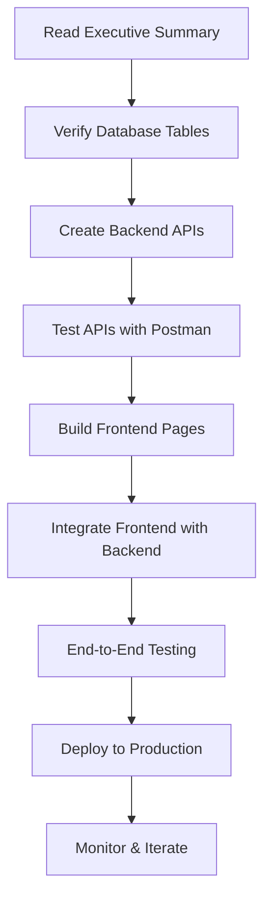

# 🗺️ COORDINATOR FEATURE VISUAL ROADMAP

**Last Updated**: November 1, 2025  
**Project**: Wedding Bazaar - Coordinator Feature Implementation  
**Status**: ✅ DOCUMENTATION COMPLETE

---

## 📚 DOCUMENTATION NAVIGATION MAP

```
START HERE 👇
├── 📊 COORDINATOR_FEATURE_EXECUTIVE_SUMMARY.md
│   └── High-level overview, status, next actions
│
├── 📋 COORDINATOR_IMPLEMENTATION_CHECKLIST.md ⭐ ACTIONABLE
│   └── Step-by-step checklist (follow daily)
│
├── 🗺️ COORDINATOR_DATABASE_MAPPING_PLAN.md
│   └── Technical blueprint, code examples
│
└── 📖 COORDINATOR_ROLE_DOCUMENTATION.md
    └── Role definition, responsibilities, features
```

---

## 🎯 IMPLEMENTATION WORKFLOW



---

## 📅 4-WEEK IMPLEMENTATION TIMELINE

```
Week 1: Backend APIs
┌─────────────────────────────────────────┐
│ Mon-Tue: Wedding Management APIs       │
│ Wed:     Milestone Management APIs     │
│ Thu:     Vendor Assignment APIs        │
│ Fri:     Dashboard & Analytics APIs    │
└─────────────────────────────────────────┘

Week 2: Frontend Pages
┌─────────────────────────────────────────┐
│ Mon-Tue: Coordinator Dashboard          │
│ Wed:     Weddings List & Create Modal   │
│ Thu:     Wedding Details Page           │
│ Fri:     Client & Vendor Network Pages  │
└─────────────────────────────────────────┘

Week 3: Testing & Polish
┌─────────────────────────────────────────┐
│ Mon-Tue: End-to-End Testing             │
│ Wed:     Bug Fixes & Error Handling     │
│ Thu:     Responsive Design & Performance│
│ Fri:     Documentation & User Guides    │
└─────────────────────────────────────────┘

Week 4: Deployment
┌─────────────────────────────────────────┐
│ Mon:     Backend Deployment (Render)    │
│ Tue:     Frontend Deployment (Firebase) │
│ Wed:     Smoke Tests & Monitoring       │
│ Thu:     User Onboarding & Training     │
│ Fri:     Launch & Celebrate! 🎉         │
└─────────────────────────────────────────┘
```

---

## 🗄️ DATABASE ARCHITECTURE VISUAL

```
┌─────────────────────────────────────────────────────┐
│                    USERS TABLE                      │
│  ┌──────────────────────────────────────────────┐  │
│  │ id: "1-2025-016" (coordinator)               │  │
│  │ user_type: "couple" (stored as individual)   │  │
│  │ email_verified: true/false                   │  │
│  └──────────────────────────────────────────────┘  │
└─────────────────────────────────────────────────────┘
                         │
                         ├─────────────────┐
                         │                 │
                         ▼                 ▼
┌──────────────────────────────┐  ┌────────────────────────┐
│   VENDOR_PROFILES TABLE      │  │ COORDINATOR_WEDDINGS   │
│  ┌────────────────────────┐  │  │  ┌──────────────────┐  │
│  │ user_id: FK to users   │  │  │  │ id: UUID         │  │
│  │ business_name          │  │  │  │ coordinator_id:FK│  │
│  │ specialties: []        │  │  │  │ couple_name      │  │
│  │ service_areas: []      │  │  │  │ wedding_date     │  │
│  │ years_experience       │  │  │  │ budget, spent    │  │
│  └────────────────────────┘  │  │  │ status, progress │  │
└──────────────────────────────┘  │  └──────────────────┘  │
                                  └────────────────────────┘
                                               │
                         ┌─────────────────────┼─────────────────────┐
                         │                     │                     │
                         ▼                     ▼                     ▼
         ┌──────────────────────┐  ┌─────────────────┐  ┌──────────────────┐
         │  WEDDING_VENDORS     │  │WEDDING_MILESTONES│  │COORDINATOR_      │
         │  ┌────────────────┐  │  │ ┌─────────────┐ │  │COMMISSIONS       │
         │  │ wedding_id: FK │  │  │ │wedding_id:FK│ │  │ ┌──────────────┐ │
         │  │ vendor_id: FK  │  │  │ │ title       │ │  │ │wedding_id:FK │ │
         │  │ status, amount │  │  │ │ completed   │ │  │ │ amount       │ │
         │  └────────────────┘  │  │ │ due_date    │ │  │ │ status       │ │
         └──────────────────────┘  │ └─────────────┘ │  │ └──────────────┘ │
                                   └─────────────────┘  └──────────────────┘
```

---

## 🔄 DATA FLOW EXAMPLES

### Flow 1: Create Wedding & Assign Vendors

```
Coordinator Creates Wedding
           │
           ▼
INSERT coordinator_weddings
  ├─ couple_name: "John & Jane"
  ├─ wedding_date: "2025-12-15"
  ├─ budget: ₱500,000
  └─ status: "planning"
           │
           ▼
Auto-create 5 Default Milestones
  ├─ "Venue Deposit Paid"
  ├─ "Caterer Confirmed"
  ├─ "Photographer Booked"
  ├─ "Save the Dates Sent"
  └─ "Final Headcount"
           │
           ▼
Create Client Record
  └─ INSERT coordinator_clients
           │
           ▼
Assign Vendors
  ├─ INSERT wedding_vendors (photographer)
  ├─ INSERT wedding_vendors (caterer)
  └─ UPDATE coordinator_vendors (stats)
           │
           ▼
Log Activity
  └─ INSERT coordinator_activity_log
```

### Flow 2: Track Progress & Calculate Commission

```
Wedding In Progress
           │
           ▼
Mark Milestones Complete
  ├─ UPDATE wedding_milestones (completed=true)
  ├─ UPDATE wedding_milestones (completed=true)
  └─ UPDATE wedding_milestones (completed=true)
           │
           ▼
Calculate Progress
  └─ 3 of 5 milestones = 60% progress
           │
           ▼
Update Wedding Progress
  └─ UPDATE coordinator_weddings (progress=60)
           │
           ▼
Track Spending
  ├─ Vendor 1 paid: ₱50,000
  ├─ Vendor 2 paid: ₱75,000
  └─ UPDATE coordinator_weddings (spent=125000)
           │
           ▼
Wedding Completed
  └─ UPDATE coordinator_weddings (status='completed')
           │
           ▼
Calculate Commission (15% of budget)
  └─ ₱500,000 × 15% = ₱75,000
           │
           ▼
Record Commission
  └─ INSERT coordinator_commissions
      ├─ amount: ₱75,000
      ├─ commission_rate: 15%
      └─ status: 'pending'
```

---

## 🎨 FRONTEND PAGES STRUCTURE

```
/coordinator
    │
    ├── /dashboard 📊
    │   ├── Stats Cards (weddings, earnings, clients)
    │   ├── Revenue Chart
    │   ├── Upcoming Weddings Table
    │   └── Recent Activity Feed
    │
    ├── /weddings 💍
    │   ├── Weddings List (with filters)
    │   ├── Create Wedding Modal
    │   ├── /weddings/:id (Wedding Details)
    │   │   ├── Wedding Header & Info
    │   │   ├── Progress Bar
    │   │   ├── Milestone Checklist
    │   │   ├── Vendor Assignment Panel
    │   │   └── Wedding Notes
    │   └── Wedding Card Component
    │
    ├── /clients 👥
    │   ├── Clients List (with status filters)
    │   ├── Add Client Modal
    │   └── /clients/:id (Client Details)
    │       ├── Client Profile
    │       ├── Wedding Link
    │       └── Communication Log
    │
    ├── /vendors 🏪
    │   ├── Vendor Network List
    │   ├── Add to Network Modal
    │   └── Vendor Performance Cards
    │       ├── Total Bookings
    │       ├── Total Revenue
    │       ├── Average Rating
    │       └── Preferred Badge
    │
    └── /commissions 💰
        ├── Commissions Overview
        ├── Pending Earnings (sum)
        ├── Total Earnings (sum)
        ├── Commissions Table (detailed list)
        └── Earnings Chart (over time)
```

---

## 📡 API ENDPOINTS MAP

### Priority 1: Core Features (Week 1)

```
Wedding Management
  POST   /api/coordinator/weddings
  GET    /api/coordinator/weddings
  GET    /api/coordinator/weddings/:id
  PUT    /api/coordinator/weddings/:id
  DELETE /api/coordinator/weddings/:id

Milestone Management
  POST   /api/coordinator/weddings/:id/milestones
  GET    /api/coordinator/weddings/:id/milestones
  PUT    /api/coordinator/milestones/:id
  PUT    /api/coordinator/milestones/:id/complete
  DELETE /api/coordinator/milestones/:id

Vendor Assignment
  POST   /api/coordinator/weddings/:id/vendors
  GET    /api/coordinator/weddings/:id/vendors
  PUT    /api/coordinator/weddings/:id/vendors/:vid
  DELETE /api/coordinator/weddings/:id/vendors/:vid

Dashboard & Analytics
  GET    /api/coordinator/dashboard/stats
  GET    /api/coordinator/analytics/weddings
  GET    /api/coordinator/analytics/revenue
```

### Priority 2: Client & Network (Week 2)

```
Client Management
  POST   /api/coordinator/clients
  GET    /api/coordinator/clients
  GET    /api/coordinator/clients/:id
  PUT    /api/coordinator/clients/:id
  DELETE /api/coordinator/clients/:id

Vendor Network
  POST   /api/coordinator/network/vendors
  GET    /api/coordinator/network/vendors
  PUT    /api/coordinator/network/vendors/:id
  DELETE /api/coordinator/network/vendors/:id

Commission Tracking
  GET    /api/coordinator/commissions
  GET    /api/coordinator/commissions/pending
  PUT    /api/coordinator/commissions/:id/mark-paid
```

---

## 🧪 TESTING CHECKLIST

### Database Testing
```
✓ Verify tables exist (7 tables)
✓ Test INSERT operations
✓ Test UPDATE operations
✓ Test DELETE operations (cascade)
✓ Test foreign key constraints
✓ Test array fields (specialties, service_areas)
✓ Test JSONB fields (verification_documents, business_hours)
✓ Test triggers (updated_at auto-update)
✓ Test views (coordinator_dashboard_stats)
```

### API Testing (Postman)
```
✓ Test authentication (JWT token required)
✓ Test authorization (coordinator can only access their data)
✓ Test input validation (missing required fields)
✓ Test error handling (invalid IDs, database errors)
✓ Test success responses (correct data returned)
✓ Test pagination (if applicable)
✓ Test filters (status, date ranges)
```

### Frontend Testing
```
✓ Test page load times (< 3 seconds)
✓ Test responsive design (mobile, tablet, desktop)
✓ Test form validation (client-side)
✓ Test error messages (user-friendly)
✓ Test loading states (spinners, skeletons)
✓ Test navigation (breadcrumbs, back buttons)
✓ Test data refresh (after mutations)
```

### Integration Testing
```
✓ Test end-to-end flow (create wedding → assign vendors → complete)
✓ Test commission calculation (correct amounts)
✓ Test progress tracking (milestone completion)
✓ Test activity logging (all actions logged)
✓ Test data consistency (across tables)
```

---

## 🚀 DEPLOYMENT CHECKLIST

### Backend Deployment (Render)
```
✓ Commit all changes to Git
✓ Push to GitHub main branch
✓ Verify auto-deploy triggered on Render
✓ Check deployment logs for errors
✓ Test API health endpoint: GET /api/health
✓ Test coordinator endpoints in production
✓ Verify database connections
✓ Monitor error logs (first 24 hours)
```

### Frontend Deployment (Firebase)
```
✓ Run production build: npm run build
✓ Test build locally: npm run preview
✓ Deploy to Firebase: firebase deploy
✓ Verify deployment success
✓ Test all pages in production
✓ Verify API integration (production URLs)
✓ Test on multiple devices (mobile, tablet, desktop)
✓ Check console for errors (browser DevTools)
```

### Post-Deployment
```
✓ Run smoke tests (critical paths)
✓ Create test wedding in production
✓ Assign test vendor
✓ Complete test milestone
✓ Verify commission calculation
✓ Delete test data
✓ Monitor user feedback
✓ Set up error tracking (Sentry, LogRocket)
```

---

## 📊 SUCCESS METRICS DASHBOARD

### MVP Success Criteria (Week 4)
```
┌─────────────────────────────────────────┐
│ ✓ Coordinators can register             │
│ ✓ Dashboard shows accurate stats        │
│ ✓ Can create/edit/delete weddings       │
│ ✓ Can assign vendors to weddings        │
│ ✓ Can track milestones                  │
│ ✓ Commission tracking accurate          │
│ ✓ Deployed to production                │
│ ✓ 0 critical bugs                       │
└─────────────────────────────────────────┘
```

### Full Feature Success Criteria (Week 6+)
```
┌─────────────────────────────────────────┐
│ ✓ All 40+ API endpoints implemented     │
│ ✓ All 5 main pages complete             │
│ ✓ Analytics and reporting functional    │
│ ✓ Mobile responsive design              │
│ ✓ Performance < 3s load time            │
│ ✓ User satisfaction > 4.5/5             │
│ ✓ Production stable (99.9% uptime)      │
└─────────────────────────────────────────┘
```

---

## 🎯 QUICK START GUIDE (3 HOURS TO MVP)

```
Hour 1: Backend Setup
  ├─ 00:00-00:05  Verify database tables (Neon console)
  ├─ 00:05-00:20  Create coordinator-weddings.cjs
  ├─ 00:20-00:30  Register routes in main server
  ├─ 00:30-00:45  Test with Postman (create, read, update)
  └─ 00:45-01:00  Create dashboard stats API

Hour 2: Frontend Development
  ├─ 01:00-01:20  Create CoordinatorDashboard.tsx
  ├─ 01:20-01:40  Add stats cards component
  ├─ 01:40-02:00  Integrate with API (fetch dashboard stats)

Hour 3: Deploy & Test
  ├─ 02:00-02:10  Commit and push to GitHub
  ├─ 02:10-02:20  Deploy backend (Render auto-deploy)
  ├─ 02:20-02:30  Deploy frontend (Firebase)
  ├─ 02:30-02:45  Run smoke tests in production
  └─ 02:45-03:00  Create demo wedding and celebrate! 🎉
```

---

## 📞 SUPPORT & RESOURCES

### Documentation Files
- 📊 Executive Summary (this file)
- 📋 Implementation Checklist (step-by-step)
- 🗺️ Database Mapping Plan (technical details)
- 📖 Role Documentation (requirements and features)

### External Resources
- [Neon Console](https://console.neon.tech) - Database management
- [Render Dashboard](https://dashboard.render.com) - Backend deployment
- [Firebase Console](https://console.firebase.google.com) - Frontend deployment
- [GitHub Repository](https://github.com/your-repo/wedding-bazaar) - Source control

### Production URLs
- Backend API: https://weddingbazaar-web.onrender.com
- Frontend App: https://weddingbazaarph.web.app
- Health Check: https://weddingbazaar-web.onrender.com/api/health

---

## ✅ COMPLETION CHECKLIST

### Before Starting
- [ ] Read Executive Summary
- [ ] Review Implementation Checklist
- [ ] Verify database tables exist
- [ ] Set up development environment

### Week 1 (Backend)
- [ ] Wedding management APIs complete
- [ ] Milestone management APIs complete
- [ ] Vendor assignment APIs complete
- [ ] Dashboard APIs complete
- [ ] All endpoints tested with Postman

### Week 2 (Frontend)
- [ ] Dashboard page complete
- [ ] Weddings list and create modal complete
- [ ] Wedding details page complete
- [ ] Client and vendor pages complete
- [ ] All pages tested in browser

### Week 3 (Testing)
- [ ] End-to-end testing complete
- [ ] Bug fixes implemented
- [ ] Performance optimized
- [ ] Responsive design verified

### Week 4 (Deployment)
- [ ] Backend deployed to Render
- [ ] Frontend deployed to Firebase
- [ ] Smoke tests passed
- [ ] User training complete
- [ ] Launch successful! 🎉

---

**Last Updated**: November 1, 2025  
**Version**: 1.0  
**Status**: ✅ READY TO START  

**Next Action**: Open `COORDINATOR_IMPLEMENTATION_CHECKLIST.md` and start Phase 1! 🚀

---

**🎊 You have everything you need. Time to build! 🎊**
