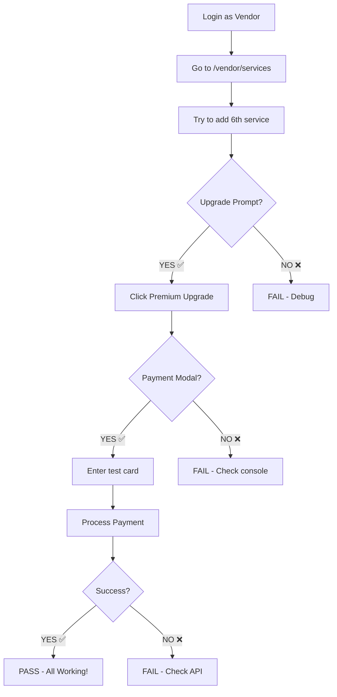

# 🚀 Quick Start - Testing Subscription Upgrade

**Ready to test in 2 minutes!**

---

## 📋 What You'll Test
- Subscription upgrade prompt
- Premium & Professional plan upgrades
- PayMongo payment integration
- Console log cleanliness (90% reduction achieved!)

---

## ⚡ Quick Start (Choose One)

### Option 1: Automated Console Test (2 minutes)
**Best for**: Quick verification

1. **Open Production Site**
   ```
   https://weddingbazaarph.web.app/vendor
   ```

2. **Login as Vendor**
   - Email: `renzrusselbauto@gmail.com`
   - Password: `your-password`

3. **Open Browser Console**
   - Press `F12`
   - Click "Console" tab

4. **Run Test Script**
   - Open: `subscription-test-script.js`
   - Copy all code
   - Paste in console
   - Press `Enter`

5. **Review Results**
   - See pass/fail summary
   - Follow manual test instructions

---

### Option 2: Manual Step-by-Step (15 minutes)
**Best for**: Thorough testing

1. **Open Test Guide**
   ```
   SUBSCRIPTION_MANUAL_TEST_GUIDE.md
   ```

2. **Follow Step-by-Step**
   - Each step has checkboxes ✅
   - Clear instructions
   - Expected results provided

3. **Complete All Tests**
   - 7 test suites
   - ~15 minutes total
   - Document any issues found

---

### Option 3: Full Test Plan (30 minutes)
**Best for**: QA/Production readiness

1. **Open Test Plan**
   ```
   SUBSCRIPTION_UPGRADE_TEST_PLAN.md
   ```

2. **Execute 17 Test Cases**
   - Comprehensive coverage
   - Fill in actual results
   - Document issues
   - Sign off when complete

---

## 🎯 Key Things to Verify

### ✅ Must Pass
1. **Upgrade prompt appears** when exceeding Free limits
2. **Payment modal opens** when clicking upgrade
3. **Console logs are clean** (≤ 8 logs per upgrade flow)
4. **No log flooding** (no repetitive render logs)
5. **Payment succeeds** with test card
6. **Subscription updates** after payment

### ❌ Should NOT See
- Render evaluation logs
- Modal state tracking logs
- Routing/navigation logs
- Any log flooding (100+ logs)

---

## 🧪 Quick Test Flow (5 minutes)



---

## 🔧 Test Credentials

### Production Site
```
URL: https://weddingbazaarph.web.app
```

### Backend API
```
URL: https://weddingbazaar-web.onrender.com
Health: https://weddingbazaar-web.onrender.com/api/health
```

### Test Card (PayMongo TEST mode)
```
Card Number: 4343 4343 4343 4345
Expiry:      12/28
CVC:         123
Name:        Test User
```

### Vendor Account
```
Email:    renzrusselbauto@gmail.com
Password: [your-password]
Vendor ID: 2-2025-001
Current Tier: Free
```

---

## 📊 Expected Console Logs (Clean!)

### Full Upgrade Flow (≤ 8 logs)
```javascript
// User triggers upgrade
🔔 [SubscriptionContext] showUpgradePrompt called: {...}
✅ [SubscriptionContext] Upgrade prompt state updated to SHOW

// User clicks upgrade
🎯 [Subscription] Upgrade clicked: Premium (₱299.00)
💳 [Subscription] Paid plan - opening payment modal

// Payment processing
📄 Step 7: Response body as text: {...}

// Modal closes
❌ [SubscriptionContext] hideUpgradePrompt called
✅ [SubscriptionContext] Upgrade prompt state updated to HIDE
```

### ❌ You Should NOT See (These were removed!)
```javascript
// NO MORE RENDER LOGS!
🔍 [UpgradePrompt] PAYMENT MODAL RENDER EVALUATION
🔄 [UpgradePrompt] Payment Modal State Changed
🎭 ═══════════════════════════════════════
📊 State Check: {...}
✅ ✅ ✅ WILL RENDER PayMongoPaymentModal...
// (This was flooding console before - NOW GONE!)
```

---

## 🐛 Common Issues & Fixes

### Issue: Upgrade prompt doesn't appear
**Fix**: 
- Check you have < 5 services (Free limit)
- Add more services to trigger limit
- Check console for errors

### Issue: Payment modal doesn't open
**Fix**:
- Check console for errors
- Verify browser console shows upgrade click log
- Hard refresh (Ctrl+Shift+R)

### Issue: Console is flooded with logs
**Fix**:
- This should be FIXED now!
- If still happening, report as bug
- Expected: ≤ 8 logs per flow

### Issue: Payment fails
**Fix**:
- Verify test card: 4343 4343 4343 4345
- Check Network tab for API errors
- Verify backend is running (health endpoint)

---

## 📞 Support

**Issues Found?**
1. Document in test plan
2. Screenshot console errors
3. Note steps to reproduce
4. Report to development team

**Test Documentation**:
- Test Plan: `SUBSCRIPTION_UPGRADE_TEST_PLAN.md`
- Manual Guide: `SUBSCRIPTION_MANUAL_TEST_GUIDE.md`
- Auto Script: `subscription-test-script.js`

---

## ✅ Success Criteria

**Tests Pass If**:
- ✅ Upgrade prompt appears correctly
- ✅ Payment modal opens
- ✅ Test card payment succeeds
- ✅ Subscription updates
- ✅ Console shows ≤ 8 logs (no flooding!)
- ✅ No errors in console
- ✅ No API failures

**Ready for Production If**:
- ✅ All 7 test suites pass
- ✅ No critical issues found
- ✅ Minor issues documented
- ✅ Test sign-off completed

---

## 🎉 Start Testing!

**Choose your path**:
1. **Quick** (2 min) → Run automated script
2. **Thorough** (15 min) → Follow manual guide
3. **Complete** (30 min) → Full test plan

**Good luck!** 🚀

---

**Last Updated**: October 29, 2025  
**Version**: 1.0  
**Status**: Ready for Testing ✅
